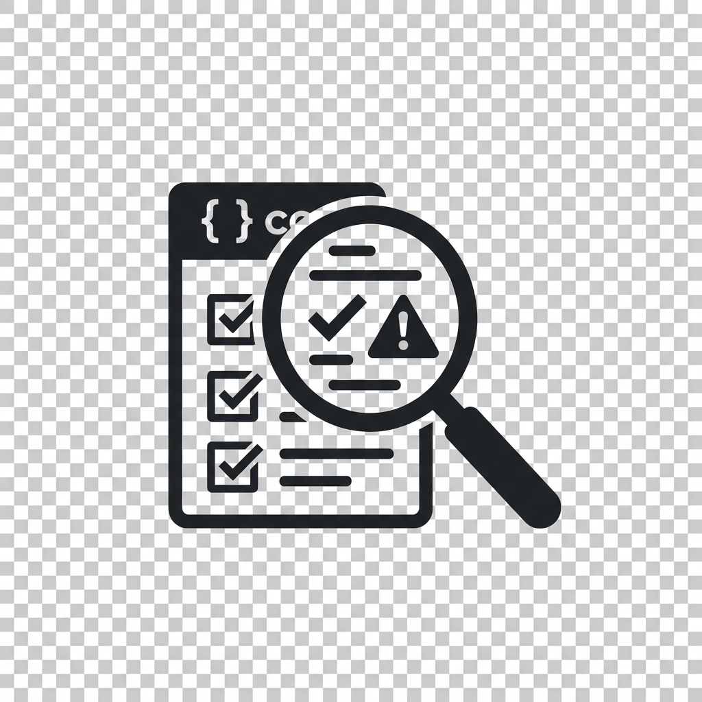

<p align="center">
  
</p>

<h1 align="center">ai-audit</h1>

<p align="center">
  <em>Think of it as a building inspection before you let the AI move in.<br>It checks the wiring, the locks, and the blueprint — then hands you a punch list.</em>
</p>

<p align="center">
  
  
  
</p>

---

## The problem

Imagine hiring a brilliant contractor but giving them no blueprint, no house rules, and locking half the rooms. They'd guess at the wiring, knock down the wrong wall, and blame *you* for not being clear.

That's what happens when an AI coding tool works in an unprepared project. It's not the AI's fault. It's the setup.

Most developers can't keep up with how fast AI tooling evolves. This is your starting point — the minimum viable setup for a codebase where AI actually works.

## Who is this for?

Two kinds of people:

**You just landed in a new repo.** Someone handed you a codebase, you opened it, and you have no idea where to start. ai-audit gives you a map — what matters, what to ignore, where the footguns are. You don't need to know what "correct" looks like. That's what this tool tells you.

**You already work with AI, and it's… fine.** You get decent results, but sometimes the AI wanders off. You fix things manually. You wonder if there's a better setup. There is. ai-audit finds the gaps in your project's AI readiness and helps you close them — one fix at a time, nothing changes without your permission.

## Before / After

**Before:** The AI reads a 2000-line file it didn't need to, guesses at your team's conventions, and accidentally modifies a generated file that breaks the build.

**After:** The AI knows the rules, reads only what it needs, checks its own work, and can't touch anything it shouldn't.

Here's what the inspection report looks like:

```
┌──────────────────────────────────────────────────────────────────┬───────────┐
│ Category                                                         │ Level     │
├──────────────────────────────────────────────────────────────────┼───────────┤
│ AI Instructions — Does the AI know the rules of this project?    │ Adequate  │
│ Documentation — Are there guides the AI can read?                │ Minimal   │
│ Sub-areas — Do complex parts have their own instructions?        │ Good      │
│ Findability — Can the AI find the right file quickly?            │ Adequate  │
│ Readability — Is the code easy for the AI to read?               │ Minimal   │
│ Verification — Can the AI check its own work?                    │ Good      │
│ Safety nets — Are there guards against the AI breaking things?   │ Missing   │
├──────────────────────────────────────────────────────────────────┼───────────┤
│ OVERALL                                                          │ Missing   │
└──────────────────────────────────────────────────────────────────┴───────────┘

Verdict: The AI can work here but will frequently misunderstand
conventions and waste effort reading oversized files.

Fix this first: Add safety rules so the AI can't accidentally
modify files it shouldn't touch.
```

**How to read it:** Missing means the AI is flying blind — expect wrong guesses. Excellent means it's fully set up for success. Everything in between is a sliding scale of "how often will you need to correct it?" The overall score is always the weakest link.

## Get started

One command. Ten seconds. No config files to write.

Open your terminal (Terminal on Mac, PowerShell on Windows) and paste this:

```bash
curl -fsSL https://raw.githubusercontent.com/ArtemTscherwinski/ai-audit/main/install.sh | bash
```

The installer asks which AI CLI you're using (Claude Code, Qoder, Cursor, Codex, …) and installs the skill there. Don't have Node.js? [Install it here first](https://nodejs.org/) (pick the LTS version).

This copies the skill into the right folder for your AI tool. It doesn't modify your projects.

Then, in any project:

```bash
cd your-project
claude
> /ai-audit
```

That's it. You'll see a scorecard in about 30 seconds. The skill walks you through fixes one by one — you say yes or no to each. Nothing changes without your permission.

## Works with

**AI tools:** Claude Code (default), Cursor, Windsurf, GitHub Copilot, Gemini CLI, Codex, Qoder

**Languages:** TypeScript, Python, Go, Rust, Swift

It automatically detects your project's language and AI tool, then checks for the right files.

## After the audit

The inspector hands you a punch list, worst problems first:

- Creates missing instruction files so the AI knows the rules
- Adds missing sections to existing docs
- Points out code problems (but won't change your code unless you ask)

You can stop at any point. You can also save the report to share with your team.

## Requirements

- [Claude Code](https://docs.anthropic.com/en/docs/claude-code) (or another supported AI tool)
- [Node.js 18+](https://nodejs.org/)
- macOS or Linux

## License

MIT

---

Found a problem or have an idea? [Open an issue](https://github.com/ArtemTscherwinski/ai-audit/issues) — it helps.
